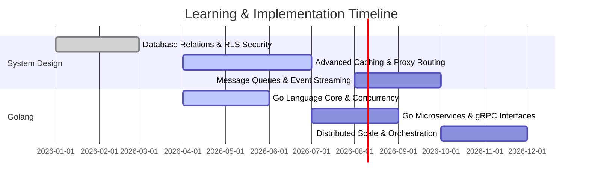

<!-- Dynamic Professional Header -->

<!-- Modern Social/Contact Anchors -->

  
  
  
  

<!-- Profile Visitor Tracking -->

---

## 👨‍💻 Professional Profile

I am a dedicated <b>Backend Software Engineer</b> focused on designing high-throughput API architectures, concurrent services, and scalable cloud-native infrastructure. Leveraging a strong foundation in <b>Python</b> and <b>Node.js</b>, I am actively specializing in <b>Golang (Go)</b> development and <b>Advanced System Design</b> (distributed caching, message-brokers, rate-limiting). I apply clean architecture principles, robust data normalization patterns, and secure design patterns to engineer production-ready software solutions.

 

*   🔭 **Current Initiatives**: Developing high-performance Go-based microservices and RESTful/gRPC interfaces.
*   🌱 **Learning & Research**: Advanced System Design patterns (Load Balancing, Redis Caching, Kafka Events, SAGAs).
*   🛡️ **Best Practices**: Domain-Driven Design (DDD), Test-Driven Development (TDD), and database-level security (RLS).
*   💬 **Let's Connect**: Open to technical discussions, architectural reviews, and backend collaboration opportunities.

---

## 📊 GitHub Contribution Dashboard

  <table border="0" cellpadding="5" cellspacing="0" width="100%">
    <tr>
      <td align="center" valign="top" width="50%">
        
      </td>
      <td align="center" valign="top" width="50%">
        
      </td>
    </tr>
  </table>

---

## ⚡ Technical Capabilities

<table width="100%">
  <thead>
    <tr>
      <th width="33%" align="left">💻 Languages & Runtimes</th>
      <th width="33%" align="left">🗄️ Database & Storage</th>
      <th width="34%" align="left">☁️ Platform & Tools</th>
    </tr>
  </thead>
  <tbody>
    <tr>
      <td valign="top">
        <ul>
          <li><b>Golang (Go)</b> — Concurrency & Microservices</li>
          <li><b>Python</b> — Flask, scripting & backend logic</li>
          <li><b>Node.js & TS/JS</b> — Express, Event-driven logic</li>
          <li><b>Dart</b> — Flutter (Cross-platform app dev)</li>
        </ul>
      </td>
      <td valign="top">
        <ul>
          <li><b>Relational</b> — PostgreSQL (RLS, schemas, triggers)</li>
          <li><b>NoSQL</b> — MongoDB, SQLite</li>
          <li><b>Caching</b> — Redis (In-Memory structures)</li>
          <li><b>BaaS</b> — Supabase, Firebase</li>
        </ul>
      </td>
      <td valign="top">
        <ul>
          <li><b>Containers</b> — Docker, Docker Compose</li>
          <li><b>Orchestration</b> — Kubernetes (K8s)</li>
          <li><b>Proxy/Gateways</b> — Nginx</li>
          <li><b>CI/CD</b> — GitHub Actions pipelines</li>
        </ul>
      </td>
    </tr>
  </tbody>
</table>

### 🛠️ Visual Tech Stack Overview

  

---

## 🗺️ Learning & Professional Development Roadmap

Below is the structured roadmap I am currently undertaking to master distributed systems scaling and production-grade backend operations:

---

## 🏆 Selected Milestones & Highlights

*   🥇 **Rising Innovator Award**: Commended for outstanding technical delivery, execution speed, and architectural clean-up.
*   📦 **App Deployments & CI/CD**: Built and deployed production apps with automated release pipelines handling provisioning, building, and signing.
*   👥 **Community Leadership**: Appointed Event Coordinator at GNDU Students' Community, organizing and directing large-scale technical and social initiatives.

---

## 📈 Development Focus

  

---

  <h3>🚀 Building Scalable Systems with Precision & Quality</h3>
  
Always open to collaboration on high-performance backends and cloud native engineering.

